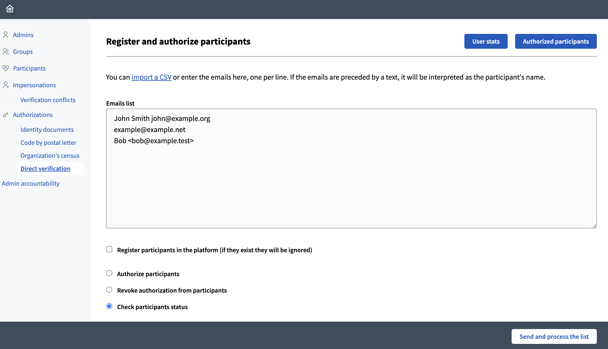

# Decidim::DirectVerifications


[](https://codeclimate.com/github/Platoniq/decidim-verifications-direct_verifications/maintainability)
[](https://codecov.io/gh/Platoniq/decidim-verifications-direct_verifications)

A [Decidim](https://github.com/decidim/decidim) that provides a verification method called `Direct verification`. Works only on the admin side, final users do not intervene in the verification process.

This plugin allows to verify users against the `Direct verification` method by default, but it is not limited to it, it can be used to directly verify users against any other method registered for the organization.

**Features:**

1. Allows to massively register users directly in the platform prior (or independently) to verify them by sending them invite emails.
> **IMPORTANT:**<br>
> You must only use this feature if you have explicit consent from your users, otherwise you might be violating the [GDPR](https://eugdpr.org/) regulation in EU.
2. Massive authroizations of users using any verification method registered for the organization **if configured**.
3. It can massively revoke authorizations given to any user with any verification method available.
4. Shows user's statuses per verification method in a simple stats table.

## Screenshot



## Usage

DirectVerifications will be available as a new verification method under Participants/Verifications.

Final users take no action, verification is 100% in the admin side.

Verifications can only be managed by the admins. They have available a simple textarea form where to put a list of emails with no special format required. Emails (and names if possible) are detected automatically.

With the detected list of emails admin have different options available:

1. Register the list of users in the platform
2. Authorize the list of users using any verification method available (defaults to the built-in `Direct verification` method).
3. Revoke the authorization for the list of users using any verification method available.
4. Check the status of the users in order to know if they are verified or registered.

### Metadata mode

This mode provides extra capabilities over the default processing:

* Reads CSV format with header (copy and paste it from your spreadsheet)
* Stores all columns except the email as authorization metadata

This enables querying the authorization metadata however fits you best.

To enable it create a new initializer called `config/initializers/decidim_direct_verifications.rb` with the following contents

```rb
Rails.application.config.direct_verifications_parser = :metadata
```

## Installation

Add this line to your application's Gemfile:

```ruby
gem "decidim-direct_verifications"
```

And then execute:

```bash
bundle
```

## Using additional verification methods

You can manage other verification methods (or workflow) a part from `Direct verification`. You need to configure it in a new file in the `config/initializers` folder.
For instance, you can use this same engine to have 2 levels of permissions in the platform. 

Create a file like `config/initializers/decidim_verifications.rb` with content as:

**`config/initializers/decidim_verifications.rb`:**

```ruby
# frozen_string_literal: true

# We are using the same DirectVerifications engine without the admin part to 
# create a custom verification method called "direct_verifications_managers"
Decidim::Verifications.register_workflow(:direct_verifications_managers) do |workflow|
  workflow.engine = Decidim::DirectVerifications::Verification::Engine
end

# We need to tell the plugin to handle this method in addition to the default "Direct verification". Any registered workflow is valid.
Decidim::DirectVerifications.configure do |config|
  config.manage_workflows = %w(direct_verifications_managers)
end

```

You will need the locales entries corresponding to your custom workflow, create as many files as languages you have in your application in `config/locales`:

**`config/locales/en.yml`:**

```yaml
en:
  decidim:
    authorization_handlers:
      direct_verifications_managers:
        name: Organization managers
        explanation: Direct Verifications Subgroup explanation
    verifications:
      authorizations:
        first_login:
          actions:
            direct_verifications_managers: Organization managers
```

Similarly, you can also overwrite the default title "Direct verification" by creating the key again in your locales:

```yaml
en:
  decidim:
    authorization_handlers:
      direct_verifications:
        name: Generic organization members
        explanation: Direct Verifications Subgroup explanation
    verifications:
      authorizations:
        first_login:
          actions:
            direct_verifications: Generic organization members
```


## Contributing

See [Decidim](https://github.com/decidim/decidim).

### Developing

To start contributing to this project, first:

- Install the basic dependencies (such as Ruby and PostgreSQL)
- Clone this repository

Decidim's main repository also provides a Docker configuration file if you
prefer to use Docker instead of installing the dependencies locally on your
machine.

You can create the development app by running the following commands after
cloning this project:

```bash
$ bundle
$ DATABASE_USERNAME=<username> DATABASE_PASSWORD=<password> bundle exec rake development_app
```

Note that the database user has to have rights to create and drop a database in
order to create the dummy test app database.

Then to test how the module works in Decidim, start the development server:

```bash
$ cd development_app
$ DATABASE_USERNAME=<username> DATABASE_PASSWORD=<password> bundle exec rails s
```

In case you are using [rbenv](https://github.com/rbenv/rbenv) and have the
[rbenv-vars](https://github.com/rbenv/rbenv-vars) plugin installed for it, you
can add the environment variables to the root directory of the project in a file
named `.rbenv-vars`. If these are defined for the environment, you can omit
defining these in the commands shown above.

#### Code Styling

Please follow the code styling defined by the different linters that ensure we
are all talking with the same language collaborating on the same project. This
project is set to follow the same rules that Decidim itself follows.

[Rubocop](https://rubocop.readthedocs.io/) linter is used for the Ruby language.

You can run the code styling checks by running the following commands from the
console:

```
$ bundle exec rubocop
```

To ease up following the style guide, you should install the plugin to your
favorite editor, such as:

- Atom - [linter-rubocop](https://atom.io/packages/linter-rubocop)
- Sublime Text - [Sublime RuboCop](https://github.com/pderichs/sublime_rubocop)
- Visual Studio Code - [Rubocop for Visual Studio Code](https://github.com/misogi/vscode-ruby-rubocop)

### Testing

To run the tests run the following in the gem development path:

```bash
$ bundle
$ DATABASE_USERNAME=<username> DATABASE_PASSWORD=<password> bundle exec rake test_app
$ DATABASE_USERNAME=<username> DATABASE_PASSWORD=<password> bundle exec rspec
```

Note that the database user has to have rights to create and drop a database in
order to create the dummy test app database.

In case you are using [rbenv](https://github.com/rbenv/rbenv) and have the
[rbenv-vars](https://github.com/rbenv/rbenv-vars) plugin installed for it, you
can add these environment variables to the root directory of the project in a
file named `.rbenv-vars`. In this case, you can omit defining these in the
commands shown above.

### Test code coverage

If you want to generate the code coverage report for the tests, you can use
the `SIMPLECOV=1` environment variable in the rspec command as follows:

```bash
$ SIMPLECOV=1 bundle exec rspec
```

This will generate a folder named `coverage` in the project root which contains
the code coverage report.

## License

This engine is distributed under the GNU AFFERO GENERAL PUBLIC LICENSE.

## Also check

This plugin has been inspired by these two nice verification methods:

- **Access Requests** by Maino Tech: https://github.com/mainio/decidim-module-access_requests
- **CSV Emails Verifications** by CodiTramuntana: https://github.com/CodiTramuntana/decidim-verifications-csv_emails
